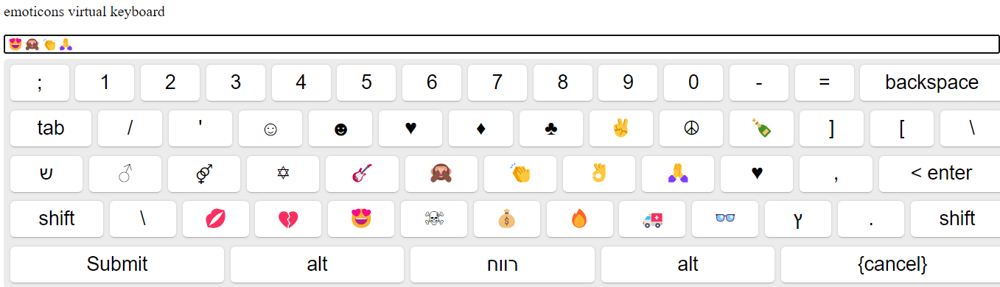

# Angular Virtual Keyboard
Hello everyone,
Our project provides a solution for displaying a virtual keyboard on the screen under the Angular platform

## Development server

Run `ng serve` for a dev server. Navigate to `http://localhost:4200/`. The application will automatically reload if you change any of the source files.

## 📦 Installation & Usage

### 1. `npm install yon-yon-virtual-keyboard --save`

### 2.  adding yon-yon-virtual packaged in app module and import him:
```
import { VirtualKeyboardModule } from 'yon-yon-virtual-keyboard';

@NgModule({
  declarations: [ ... ],
  imports: [
    CommonModule,
    VirtualKeyboardModule
  ]
})
export class AppModule { }
```

### 3. Adding 'lib-VirtualKeyboard' element right to html code: 
```
<p>We don't use with any validate and accept</p>

<lib-VirtualKeyboard [language]="'en'"></lib-VirtualKeyboard>

<p>We use with validate and accept</p>

<lib-VirtualKeyboard [language]="'he'" [validateCallBack]="validate" [acceptCallBack]="accept"></lib-VirtualKeyboard>

<p>We use with validateNumber and accept</p>

<lib-VirtualKeyboard [language]="'he'" [validateCallBack]="validateNumber" [acceptCallBack]="accept"></lib-VirtualKeyboard>

<p>With numeric</p>

<lib-VirtualKeyboard [language]="'num'" [validateCallBack]="validateNumber" [acceptCallBack]="accept"></lib-VirtualKeyboard>

<p>Custom Virtual Keyboard</p>

<lib-VirtualKeyboard [keyboardLayout]="custom_Keyboard"></lib-VirtualKeyboard>

<p>emoticons virtual keyboard</p>

<lib-VirtualKeyboard [language]="'emo'"></lib-VirtualKeyboard>
```

## Further help

We would like to thank some of the fathers of the projects we are building on and for us they are the cornerstones.

1. [Rob Garrison](https://github.com/Mottie/Keyboard) The father of all virtual keyboards, With his code we     defined  the whole issue of keyboards layout and keys events. 
2. [Francisco Hodge](https://github.com/simple-keyboard/angular-simple-keyboard) Our code is built on his code while performing analysis, modification and adaptation to the Angular platform  
